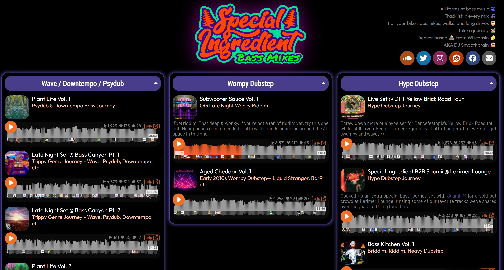

<!-- Badges link: https://github.com/Ileriayo/markdown-badges -->

## 🌟&nbsp; Skills &nbsp;🌟

<table>
  <tr>
    <td colspan="2" align="center">
      <h3>🖥️🖥️&nbsp;&nbsp;&nbsp;  Core Development  &nbsp;&nbsp;&nbsp;🖥️🖥️</h3>
    </td>
  </tr>
  <tr>
    <td align="right"><em>Languages</em></td>
    <td align="center">
      
      
       
      
      
      
    </td>
  </tr>
  <tr>
    <td align="right"><em>Dev Tools</em></td>
    <td align="center">
      
      
      
      
    </td>
  </tr>
  <tr>
    <td align="right"><em>Libraries</em></td>
    <td align="center">
      
      
      
    </td>
  </tr>
  <tr>
    <td align="right"><em>Skills</em></td>
    <td align="center">
      
    </td>
  </tr>
  <tr>
    <td colspan="2" align="center">
      <h3>🧪🧪&nbsp;&nbsp;&nbsp;  Testing  &nbsp;&nbsp;&nbsp;🧪🧪</h3>
    </td>
  </tr>
  <tr>
    <td align="right"><em>E2E</em></td>
    <td align="center">
      
      
      
    </td>
  </tr>
  <tr>
    <td align="right"><em>Unit</em></td>
    <td align="center">
      
      
      
    </td>
  </tr>
  <tr>
    <td align="right"><em>API</em></td>
    <td align="center">
      
    </td>
  </tr>
  <tr>
    <td colspan="2" align="center">
      <h3>🛠️🛠️&nbsp;&nbsp;&nbsp;  Tools  &nbsp;&nbsp;&nbsp;🛠️🛠️</h3>
    </td>
  </tr>
 <tr>
    <td align="right"><em>AI</em></td>
    <td align="center">
      
       
      
      
      
    </td>
  </tr>
  <tr>
    <td align="right"><em>CI / CD</em></td>
    <td align="center">
      
    </td>
  </tr>
   <tr>
    <td align="right"><em>Project Mgmt.</em></td>
    <td align="center">
      
      
    </td>
  </tr>
   <tr>
    <td colspan="2" align="center">
      <h3>📝📝&nbsp;&nbsp;&nbsp;  Other Languages  &nbsp;&nbsp;&nbsp;📝📝</h3>
    </td>
  </tr>
  <tr>
    <td><i>Hardware</i></td>
    <td align="center">
      
    </td>
  </tr>
</table>

## 💎&nbsp; Owned Projects &nbsp;💎

<table>
  <tbody>
    <tr>
      <td align="center"><h3>⚛️⚛️&nbsp;&nbsp;&nbsp; React Websites &nbsp;&nbsp;&nbsp;⚛️⚛️</h3></td>
    </tr>
    <tr>
      <td align="center">
        <strong><a href="https://bvandercar-vt.github.io/bike-ride-mapper/">Bike Ride Tracker</a></strong>
         
        A map overlaying every bike ride I've done over the past few years.&nbsp;<a href="https://github.com/bvandercar-vt/bike-ride-mapper">[repo]</a>
        <!--  
          -->
      </td>
    </tr>
     <tr>
      <td align="center">
        <strong><a href="https://task-rankr.replit.app/guest">TaskRankr</a></strong>
         
        A fancy task tracking and prioritizing todo list app. My latest project and first heavily AI-assisted project I have done, putting careful review, code cleanup, and refactoring into largely AI-generated code, by way of creating, modifying, and reviewing PRs for each feature.&nbsp;<a href="https://github.com/bvandercar-vt/TaskRankr">[repo]</a>
      </td>
    </tr>
    <tr>
      <td align="center">
        <strong><a href="https://specialingredientbass.com/">DJ Website</a></strong>
         
        My side hobby. All custom React components, using the SoundCloud API.&nbsp;<a href="https://github.com/bvandercar-vt/specialingredientbass.com">[repo]</a>
        <!--  
          -->
      </td>
    </tr>
    <tr>
      <td align="center">
        <strong><a href="https://womanhoodofwubz.neocities.org/">Retail Website</a></strong>
         
        Retail website for a friend using a CMS and custom React components.&nbsp;<a href="https://github.com/bvandercar-vt/womanhoodofwubz.com">[repo]</a>
        <!--  
          -->
      </td>
    </tr>
    <tr>
      <td align="center"><h3>📦📦&nbsp;&nbsp;&nbsp; NPM Packages &nbsp;&nbsp;&nbsp;📦📦</h3></td>
    </tr>
    <tr>
      <td align="center">
        <strong><a href="https://www.npmjs.com/package/react-component-test-suite">react-component-test-suite</a></strong>
         
        Create custom React component test suites for Vitest or Jest that automatically give the name of the React component to the title of the test suite.
      </td>
    </tr>
    <tr>
      <td align="center">
        <strong><a href="https://www.npmjs.com/package/glob-sort">glob-sort</a></strong>
         
        Provide custom rules to sort nested glob results. Useful for test configuration.
      </td>
    </tr>
    <tr>
      <td align="center"><h3>🌔🌔&nbsp;&nbsp;&nbsp; Python Packages &nbsp;&nbsp;&nbsp;🌖🌖</h3></td>
    </tr>
    <tr>
      <td align="center">
        <strong><a href="https://pypi.org/project/serato-tools/">serato-tools</a></strong>
         
        Various Python tools for the Serato DJ software&nbsp;&nbsp;<a href="https://github.com/bvandercar-vt/serato-tools">[repo]</a>
      </td>
    </tr>
    <tr>
      <td align="center">
        <strong><a href="https://pypi.org/project/serato-usb-export/">serato-usb-export</a></strong>
         
        USB Export tool for the Serato DJ software
      </td>
    </tr>
  </tbody>
</table>

## 📈&nbsp; Stats &nbsp;📈

<!-- https://github.com/anuraghazra/github-readme-stats -->
 

<!-- https://github.com/DenverCoder1/github-readme-streak-stats -->
<!--  -->

<!-- https://github.com/bvandercar-vt/github-repository-contribution-stats -->
 

<!--   -->

<!-- https://github.com/lowlighter/metrics -->
<!-- TODO: see why this has higher numbers, and contribute fixes to the other repos -->
<!--   -->

<!--  -->

## 🎉&nbsp; Beyond Code &nbsp;🎉

When I'm not coding, you'll find me:

🎧 DJing 🎧  
🚴 Bike Riding to explore Denver 🚴  
⛷️ Hitting the slopes with friends ⛷️  
✈️ Exploring my neighborhood, Colorado, and the world! ✈️  
🎬 Checking out good movies 🎬  
🎵 Catching live music 🎵

