<!-- Badges link: https://github.com/Ileriayo/markdown-badges -->

## 🌟&nbsp; Skills &nbsp;🌟

<table>
  <tr>
    <td colspan="2" align="center"><h3>🖥️🖥️&nbsp;&nbsp;&nbsp;  Frontend  &nbsp;&nbsp;&nbsp;🖥️🖥️</h3></td>
  </tr>
  <tr>
    <td align="right"><em>Languages</em></td>
    <td align="center">
      
      
      
      
      
    </td>
  </tr>
  <tr>
    <td align="right"><em>Dev Tools</em></td>
    <td align="center">
      
      
    </td>
  </tr>
  <tr>
    <td align="right"><em>Libraries</em></td>
    <td align="center">
      
      
    </td>
  </tr>
  <tr>
    <td align="right"><em>Skills</em></td>
    <td align="center">
      
    </td>
  </tr>
  <tr>
    <td colspan="2" align="center"><h3>🧪🧪&nbsp;&nbsp;&nbsp;  Testing  &nbsp;&nbsp;&nbsp;🧪🧪</h3></td>
  </tr>
  <tr>
    <td align="right"><em>E2E</em></td>
    <td align="center">
      
      
      
    </td>
  </tr>
  <tr>
    <td align="right"><em>Unit</em></td>
    <td align="center">
      
      
      
    </td>
  </tr>
  <tr>
    <td align="right"><em>API</em></td>
    <td align="center">
      
    </td>
  </tr>
  <tr>
    <td colspan="2" align="center"><h3>📝📝&nbsp;&nbsp;&nbsp;  Other Languages  &nbsp;&nbsp;&nbsp;📝📝</h3></td>
  </tr>
  <tr>
    <td align="right"><em>Scripting</em></td>
    <td align="center">
      
    </td>
  </tr>
  <tr>
    <td align="right"><em>Hardware</em></td>
    <td align="center">
      
    </td>
  </tr>
  <tr>
    <td colspan="2" align="center"><h3>🛠️🛠️&nbsp;&nbsp;&nbsp;  Tools &nbsp;&nbsp;&nbsp;🛠️🛠️</h3></td>
  </tr>
  <tr>
    <td align="right"><em>Project Mgmt.</em></td>
    <td align="center">
      
      
    </td>
  </tr>
  <tr>
    <td align="right"><em>Version Control</em></td>
    <td align="center">
      
      
      
    </td>
  </tr>
</table>

## 💎&nbsp; Owned Projects &nbsp;💎

<table>
  <thead>
    <tr>
      <th>Project</th>
      <th>Description</th>
      <th>Repo</th>
    </tr>
  </thead>
  <tbody>
    <tr>
      <td colspan="3"><strong>⚛️&nbsp; React Websites &nbsp;⚛️</strong></td>
    </tr>
    <tr>
      <td><strong><a href="https://bvandercar-vt.github.io/bike-ride-mapper/">My Bike Ride Tracker</a></strong></td>
      <td><em>A map overlaying every bike ride I've done over the past few years.</em></td>
      <td><a href="https://github.com/bvandercar-vt/bike-ride-mapper">🔗</a></td>
    </tr>
    <tr>
      <td><strong><a href="https://specialingredientbass.com/">DJ Website</a></strong></td>
      <td><em>My side hobby. All custom React components and CSS, using the SoundCloud API.</em></td>
      <td><a href="https://github.com/bvandercar-vt/specialingredientbass.com">🔗</a></td>
    </tr>
    <tr>
      <td><strong><a href="https://womanhoodofwubz.neocities.org/">Retail Website</a></strong></td>
      <td><em>Retail website for a friend using a CMS and custom React components.</em></td>
      <td><a href="https://github.com/bvandercar-vt/womanhoodofwubz.com">🔗</a></td>
    </tr>
    <tr>
      <td colspan="3"><strong>📦&nbsp; NPM Packages &nbsp;📦</strong></td>
    </tr>
    <tr>
      <td><strong><a href="https://www.npmjs.com/package/react-component-test-suite">react-component-test-suite</a></strong></td>
      <td><em>For creating custom React component test suites for Vitest or Jest that name the suite the name of the React component.</em></td>
      <td></td>
    </tr>
    <tr>
      <td><strong><a href="https://www.npmjs.com/package/glob-sort">glob-sort</a></strong></td>
      <td><em>For configuring sorting of glob folder results. Namely for Cypress tests, but has universal usage.</em></td>
      <td></td>
    </tr>
    <tr>
      <td colspan="3"><strong>🌔&nbsp; Python Packages &nbsp;🌖</strong></td>
    </tr>
    <tr>
      <td><strong><a href="https://pypi.org/project/serato-tools/">serato-tools</a></strong></td>
      <td><em>Various Python tools for the Serato DJ software</em></td>
      <td><a href="https://github.com/bvandercar-vt/serato-tools">🔗</a></td>
    </tr>
    <tr>
      <td><strong><a href="https://pypi.org/project/serato-usb-export/">serato-usb-export</a></strong></td>
      <td><em>USB Export tool for the Serato DJ software</em></td>
      <td><a href="https://github.com/bvandercar-vt/serato-tools">🔗</a></td>
    </tr>
  </tbody>
</table>

## 📈&nbsp; Stats &nbsp;📈

<!-- https://github.com/anuraghazra/github-readme-stats -->

<!-- https://github.com/DenverCoder1/github-readme-streak-stats -->
<!--  -->

<!-- https://github.com/bvandercar-vt/github-repository-contribution-stats -->

<!--   -->

<!-- https://github.com/lowlighter/metrics -->

<!--  -->

## 🎉&nbsp; Beyond Code &nbsp;🎉

When I'm not coding, you'll find me:

🎧 DJing 🎧  
🚴 Bike Riding to explore Denver 🚴  
⛷️ Hitting the slopes with friends ⛷️  
✈️ Exploring my neighborhood, Colorado, and the world! ✈️  
🎬 Checking out good movies 🎬  
🎵 Catching live music 🎵
